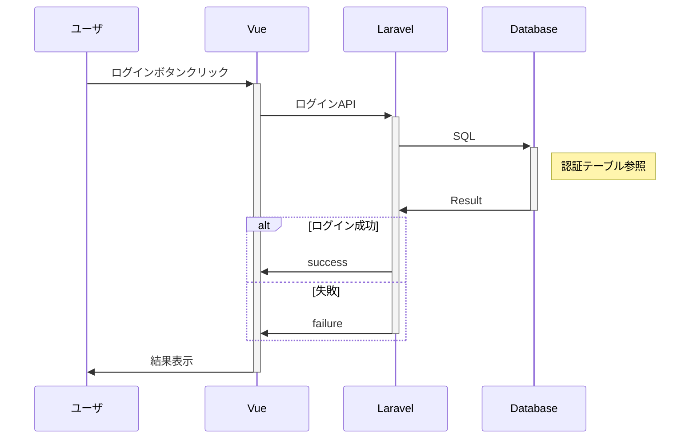
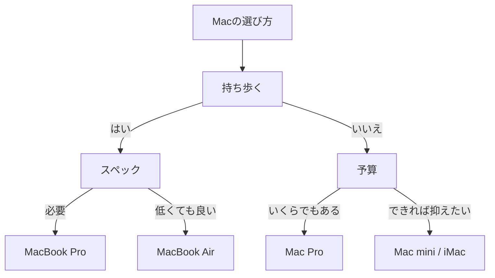
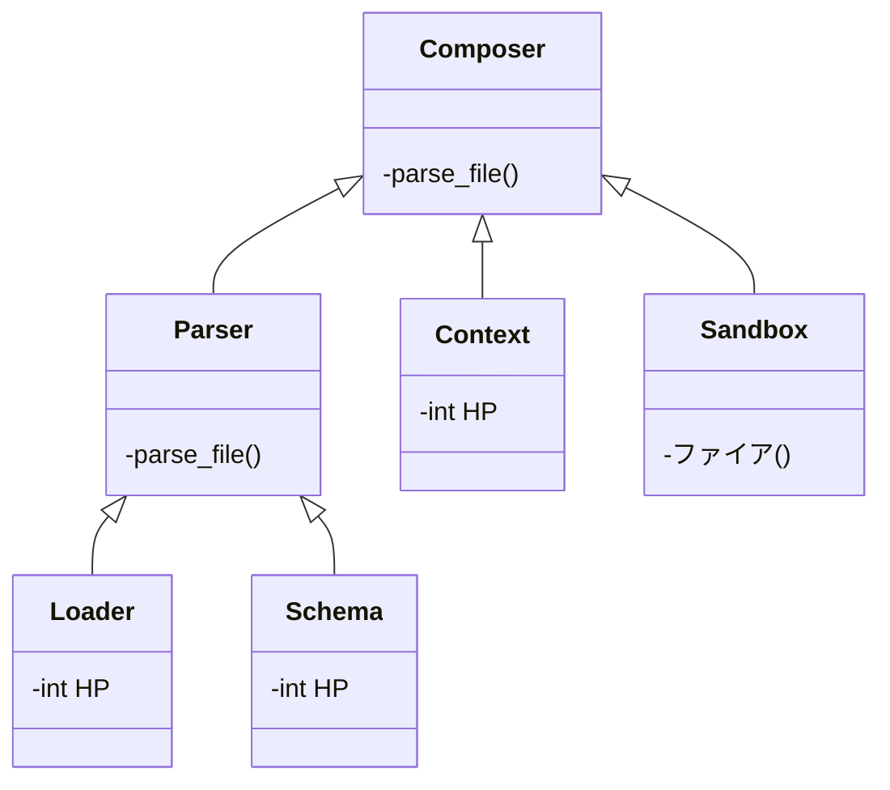
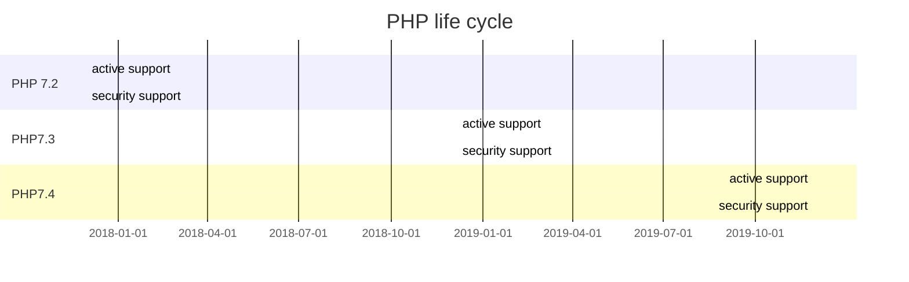
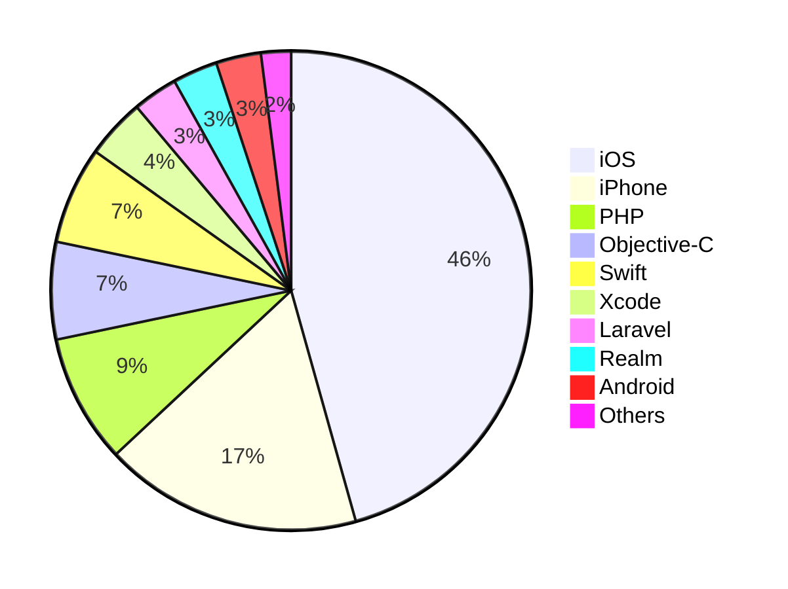
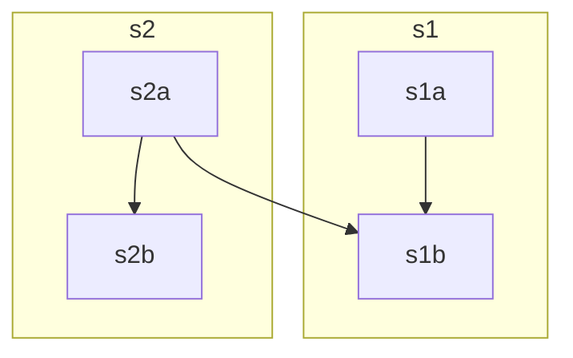

<p align="center" style="margin: 0 0 10px">
  
</p>

<h1 align="center" style="font-size: 3rem; margin: -15px 0">
HTTPX
</h1>

---

<div align="center">
<p>
<a href="https://github.com/encode/httpx/actions">
    
</a>
<a href="https://pypi.org/project/httpx/">
    
</a>
</p>

<em>A next-generation HTTP client for Python.</em>
</div>

HTTPX is a fully featured HTTP client for Python 3, which provides sync and async APIs, and support for both HTTP/1.1 and HTTP/2.


!!! note
    HTTPX should currently be considered in beta.

    We believe we've got the public API to a stable point now, but would strongly recommend pinning your dependencies to the `0.18.*` release, so that you're able to properly review [API changes between package updates](https://github.com/encode/httpx/blob/master/CHANGELOG.md).

    A 1.0 release is expected to be issued sometime in 2021.

---


## Features

- httpxのapiに基づいたリクエストの一括管理
- レスポンスの検証
- テストとバッチ処理支援

## Documentation


## Dependencies

- `httpx`

## Installation

Install with pip:

```shell
$ pip install httpx
```

Or, to include the optional HTTP/2 support, use:

```shell
$ pip install httpx[http2]
```

To include the optional brotli decoder support, use:

```shell
$ pip install httpx[brotli]
```

HTTPX requires Python 3.6+

[sync-support]: https://github.com/encode/httpx/issues/572


# Getting Started

```python
import mink

jobs = mink.load("sample.yml")
jobs = jobs.filter(tags=["production", "daily"], name=lambda x: "" in x)
jobs = jobs.tasks.filter(tags={"15"})

jobs.run(manager)

```


# expression

- 環境変数が読み込めます　例：　${ENV_NAME}
- 環境変数が存在しない場合のデフォルト値を設定できます　例：　${ENV_NAME:DEFAULT_VALUE}
- evalによる複雑な評価を行えます　例：　status_code: !eval 200 <= x and x < 300

# 設計

- 独自タグ
    - yamlのタグ機能で基本型以外も値として定義できます
    - ref:  <module>:<attr> | <variable> でpythonオブジェクトを参照することができます
    - type:  <module>:<attr> | <variable>  でpythonクラスを指定し初期化できます
    - eval: 式を評価することができます。

- リゾルバ
    - 環境変数: yamlのパース時に文字列として埋め込まれます。存在しない場合はNoneと解釈されます
    - 変数: yamlのアンカー等を利用します


# 類似ツール

## github actions
ifでevalを扱うことができる

``` yaml
    if: ${{ secrets.ref == 'refs/heads/main' }}
```

github actionsはsecretsと呼ばれるコンテキストに変数を設定し、secretsで変数にアクセスする。
yamlに展開すると、機密情報がログに出力されてしまったりするので、サンドボックスでのみアクセス可能にするのはいい考えのような気がする

## tavern
saveで変数を保持し、"{val_name:type}"で参照できる

``` yaml
stages:
  - name: Make sure we have the right method
    request:
      url: https://kaka-request-dumper.herokuapp.com/
      method: GET
      save:
        json:
          returned_method: method

  - name: Make sure we have the right returned_method
    request:
      url: https://kaka-request-dumper.herokuapp.com/
      method: GET
      params:
        returned_method: "{returned_method:s}"
```

includeで共通定義を読み込める


```
description: used for github api testing
name: test includes
variables:
  service:
    token: "token"
    owner: "リポジトリオーナー"
    repo: "リポジトリ"
```

```
includes:
  - !include common.yaml
```

環境変数展開については記述がない
pytestで実行でき、pytestで結果を表示できる
















